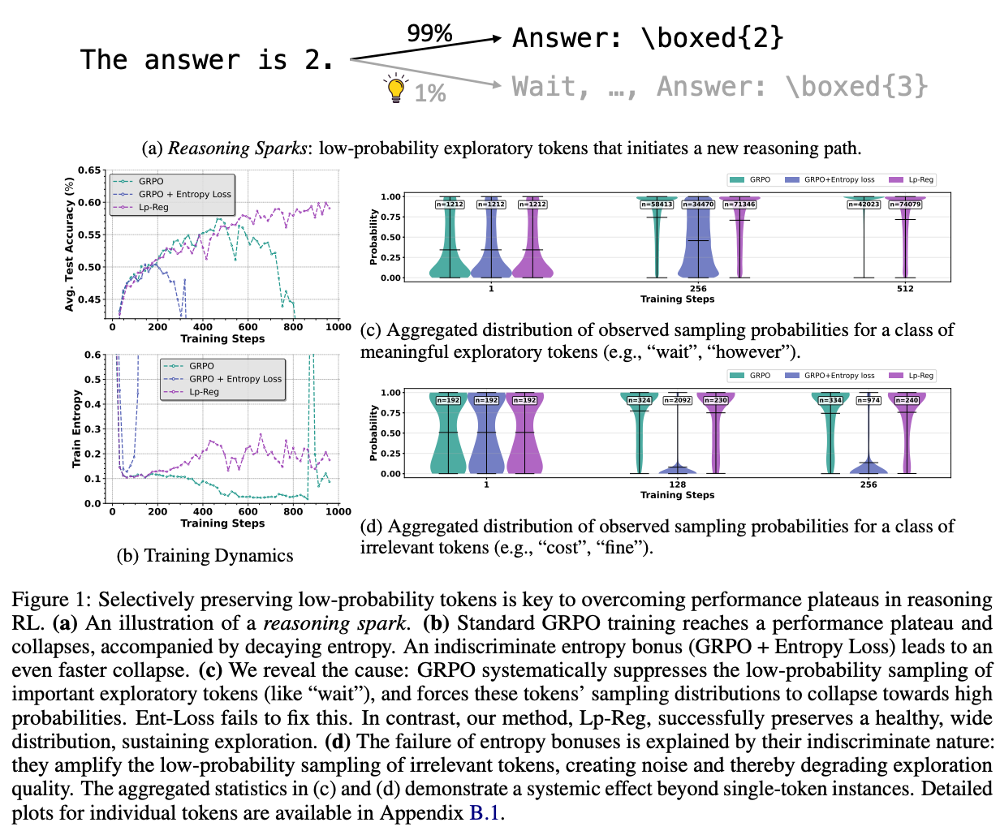

# Lp-Reg-Dev
You can reproduce the results from our paper using this development version, which is based on [Entropy-Mechanism-of-RL](https://github.com/PRIME-RL/Entropy-Mechanism-of-RL/tree/main/recipe). This version utilizes an earlier release of [veRL](https://github.com/volcengine/verl). Currently, we are integrating [Lp-Reg](https://github.com/CarlanLark/Lp-Reg) into the latest version of [veRL](https://github.com/volcengine/verl) to deliver a cleaner and more streamlined implementation.

## Introduction
This paper investigates the exploration dynamics within RLVR and identifies a key issue of its training collapse: the gradual elimination of valuable low-probability exploratory tokens, which we term *reasoning sparks*. We find that while abundant in pre-trained models, these sparks are systematically extinguished during RLVR due to over-penalization, leading to a degeneracy in exploration. In contrast, indiscriminate entropy bonuses often fail by amplifying destructive noise. To address this, we introduce Low-probability Regularization (Lp-Reg). Its core mechanism regularizes the policy towards a heuristic proxy distribution. This proxy is constructed by filtering out presumed noise tokens and re-normalizing the distribution over the remaining candidates. The result is a less-noisy proxy where the probability of *reasoning sparks* is amplified, which then serves as a soft regularization target to shield these valuable tokens from elimination via KL divergence. 

<div align="left">
  
</div>

## Getting Started
We inherit environment setup and quick start from VERL. Please follow the official docs:

* **Install:** [https://verl.readthedocs.io/en/latest/start/install.html](https://verl.readthedocs.io/en/latest/start/install.html)
* **Quick Start:** [https://verl.readthedocs.io/en/latest/start/quickstart.html](https://verl.readthedocs.io/en/latest/start/quickstart.html)

## Training
Before running the following scripts, ensure Ray is running on all nodes.

For training Qwen3-14B on multi nodes, you can run:
```
cd Lp-Reg
bash ./recipe/lp_reg/Qwen3_14b_lp_reg_onpolicy_64gpu.sh
```

While for training Qwen2.5-32B on multi nodes, you can run:
```
cd Lp-Reg
bash ./recipe/lp_reg/Qwen2.5_32b_lp_reg_onpolicy_64gpu.sh
```

## Evaluation
Before evaluation, you need to ensure that the AIME, AIME25 datasets are with "data_source" of "aime", "aime25" and respectively. As we hardcode it to make sure they are rollouted with temperature of 0.6.


## Results
On-policy Lp-Reg shows a stable performance increasing around 1,000 training steps with a dynamic, multi-phase entropy trajectory: entropy initially decreases as the model learns core reasoning patterns, then gradually increases to foster exploration as performance improves, and finally stabilizes within a healthy range as accuracy converges.

<div align="left">
  
</div>

<div align="left">
  
</div>

# Acknowledgement
We implement our reinforcement learning algorithm extending from [veRL](https://github.com/volcengine/verl) and [Entropy-Mechanism-of-RL](https://github.com/PRIME-RL/Entropy-Mechanism-of-RL/tree/main/recipe). We utilize [vLLM](https://github.com/vllm-project/vllm) for inference. Thanks to them for their excellent work!

## Citation
```bibtex
@article{huang2025lowprob,
  title   = {Low-probability Tokens Sustain Exploration in Reinforcement Learning with Verifiable Reward},
  author  = {Guanhua Huang, Tingqiang Xu, Mingze Wang, Qi Yi, Xue Gong, Siheng Li, Ruibin Xiong, Kejiao Li, Yuhao Jiang, Bo Zhou},
  year    = {2025},
  journal = {arXiv preprint},
}
```

## Acknowledgement

## Contact
* Guanhua Huang — [carlan0974@gmail.com](mailto:carlan0974@gmail.com)
